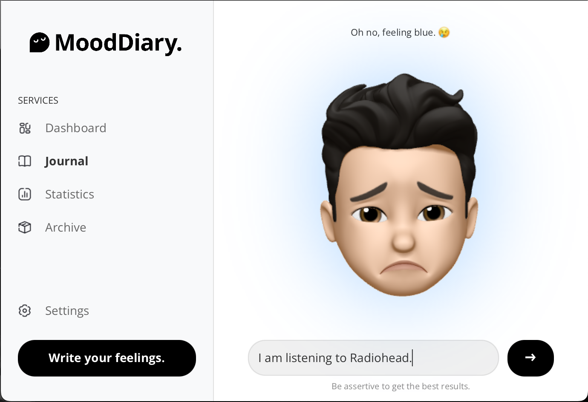

                         
 

<h1 align="center">MoodDiary.</h1>

An awesome application to track your mood using AI.

  

 ## About The Project

Introducing MoodDiary: an advanced JavaFX application developed as part of the Human Interaction with Computers subject at Universidade da Beira Interior. Seamlessly integrating with a Python backend powered by AI, MoodDiary offers users a comprehensive platform for mood management. Gain personalized insights and recommendations while tracking your emotional journey effortlessly. Elevate your well-being with MoodDiary, where technology meets emotions.
### Built With

- **JavaFX**: OpenJFX is utilized for creating the graphical user interface (GUI) of the application.
  
- **Python**: The backend logic and machine learning components are implemented in Python.
  
- **Flask**: Flask is used to create the web server for handling HTTP requests and responses in the backend.
  
- **Hugging Face Transformers**: The Transformers library is employed for natural language processing tasks, including text classification for emotion detection.
  
- **CSS**: Cascading Style Sheets are applied for styling the web interface of the Flask application.

 ## Roadmap

- [x] Build a Python Enviroment to run the AI Agent.
- [x] Transfer it's Docker Image to an External Server.
- [ ] Do the Frontend using JavaFX.

See the [open issues](https://github.com/diogogomesaraujo/MoodDiary/issues) for a full list of proposed features (and known issues).
 ## License

Distributed under the MIT License. See [MIT License](https://opensource.org/licenses/MIT) for more information.
 ## Acknowledgments

This project was developed by:

- [Diogo Araújo](https://github.com/diogogomesaraujo)
- [Diogo Rodrigues](https://github.com/DiogoRodriguesz)
